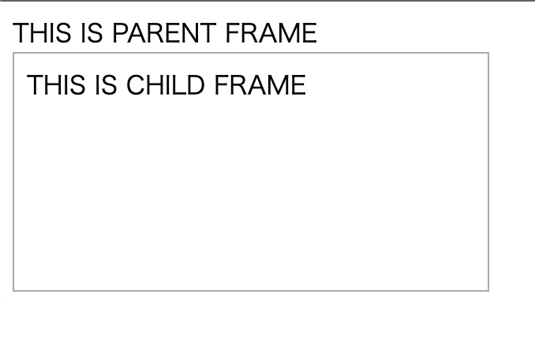
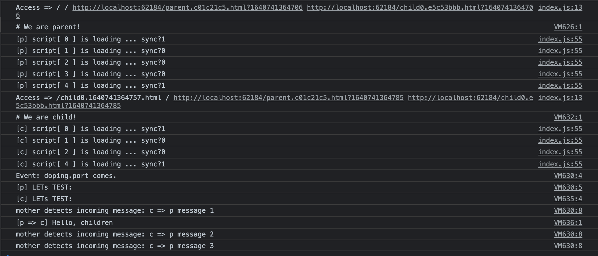

# doping
  
[](https://travis-ci.org/ystskm/doping-js)  
  
Multi-domain dope strategy.
Use browser channel port for interaction.

## Install

Install writing sources head tag.
    
## API - Doping via iframe

Dependencies: [browser-emitter-js](https://github.com/ystskm/browser-emitter-js)  

Test execution can check with parcel:

```sh
npm i && npm run test:serve
```

And access to the url e.g. `http://localhost:1234/`

`parent.html`
```html
<script type="text/javascript"> console.log('# We are parent!'); </script>
<script type="text/javascript" src="../libs/Emitter-0.7.2.js"></script>
<script type="text/javascript" src="../doping.js"></script>
<script type="text/javascript" src="../doping-server.js"></script>
<script type="text/javascript">
(()=>{
  
  // Doping.emitter.on('doping.port', ... ) で iframe からの接続要求を待機する。
  Doping.emitter.on('doping.port', mother=>{
    console.log('Event: doping.port comes.');
    console.log('[p] LETs TEST:');
    mother.evalJs('console.log("[p => c] Hello, children")');
    mother.on('incoming', msg=>{
      console.log('mother detects incoming message:', msg);
    });
  });

})();
</script>
<div> THIS IS PARENT FRAME </div>
<iframe style="border:1px solid #aaa;"/>
```

`children.html`
```html
<script type="text/javascript"> console.log('# We are child!'); </script>
<script type="text/javascript" src="../doping.js"></script>
<script type="text/javascript" src="../doping-client.js"></script>
<div> THIS IS CHILD FRAME </div>
<script>
(()=>{
  
  // Doping.ready.then(()=> ... ) で iframe の [c] ping => [p] ping => [c] resolve を待機する
  Doping.ready.then(()=>{
    console.log('[c] LETs TEST:');
    Doping.port.postMessage('c => p message 1');
    Doping.port.postMessage('c => p message 2');
    Doping.port.postMessage('c => p message 3');  
  });
  
})();
</script>
```

## Evidence

**display**


**console**


## API

**parent**

`Doping.emitter.on("doping.port", mother=> ...)`
   ... Detect access request from doping-client and established the connection

`Doping.get(<Number>i)`
   ... Get a connection mother
   
`mother.toHead`
   ... Set item to head
   
`mother.toBody`
   ... Set item to body
   
`mother.evalJs`
   ... Eval a script on child
   
`mother.port.postMessage(<String>msg)`
   ... Sending a message to child
   

**child**

`Dopiong.port.postMessage(<String>msg)`
   ... Sending a message to parent
   